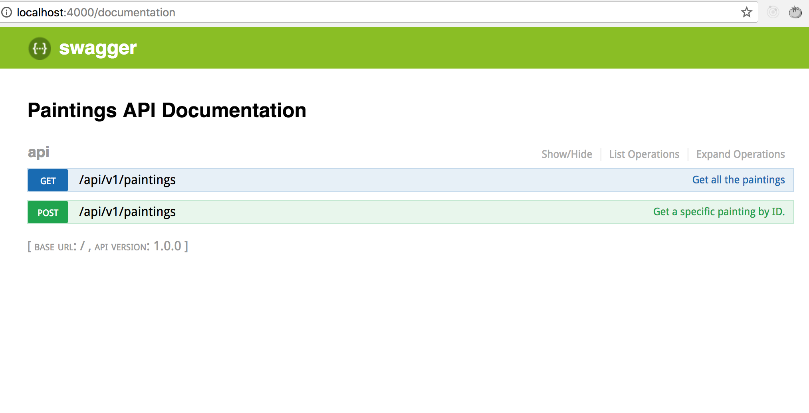

# Create a powerful API on Node.js, GraphQL, MongoDB, Hapi and Swagger

### Demo

### Setup

`$ yarn install && open http://localhost:4000 && yarn run start`

### Tutorial Reference

[How to set-up a powerful API with Nodejs, GraphQL, MongoDB, Hapi, and Swagger, Part I](https://levelup.gitconnected.com/how-to-setup-a-powerful-api-with-nodejs-graphql-mongodb-hapi-and-swagger-e251ac189649)

[How to set-up a powerful API with Nodejs, GraphQL, MongoDB, Hapi, and Swagger, Part II](https://levelup.gitconnected.com/how-to-set-up-a-powerful-api-with-nodejs-graphql-mongodb-hapi-and-swagger-part-ii-80266790a3ac)